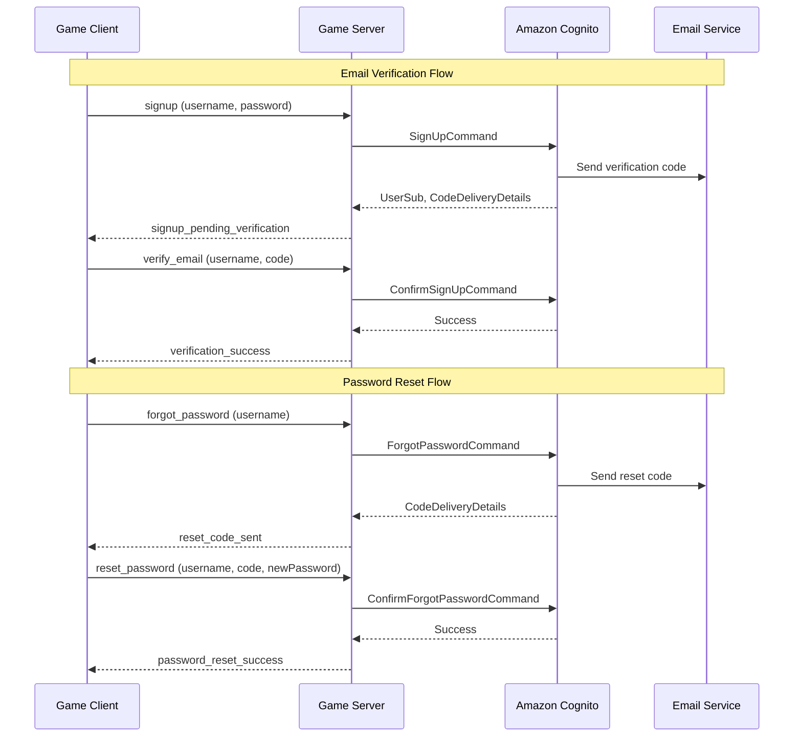

# Design Document

## Overview

This design implements email verification and password reset functionality for the Spirit of Kiro authentication system. The solution leverages Amazon Cognito's built-in email verification and password reset capabilities, removing the current auto-confirmation behavior and adding new WebSocket message handlers and client views to support the verification and reset workflows.

The design maintains the existing WebSocket-based communication pattern between the Game Client and Game Server, ensuring consistency with the current architecture while adding new message types and UI flows.

## Architecture

### High-Level Flow



### Component Interactions

1. **Game Client** sends authentication-related messages via WebSocket
2. **Game Server** receives messages, validates inputs, and calls Cognito APIs
3. **Amazon Cognito** handles user management, code generation, and email delivery
4. **Email Service** (configured in Cognito) delivers verification and reset codes

## Components and Interfaces

### Server-Side Components

#### New Message Handlers

**1. verify-email.ts**
- Handles email verification code submission
- Uses Cognito's `ConfirmSignUpCommand`
- Returns success or error response

**2. resend-verification.ts**
- Resends verification code for unverified users
- Uses Cognito's `ResendConfirmationCodeCommand`
- Implements rate limiting through Cognito's built-in throttling

**3. forgot-password.ts**
- Initiates password reset flow
- Uses Cognito's `ForgotPasswordCommand`
- Returns generic success message to prevent user enumeration

**4. reset-password.ts**
- Completes password reset with code and new password
- Uses Cognito's `ConfirmForgotPasswordCommand`
- Validates new password meets requirements

#### Modified Handlers

**signup.ts**
- Remove `AdminConfirmSignUpCommand` call
- Return `signup_pending_verification` response type
- Include code delivery details in response

**signin.ts**
- Add check for unverified users
- Return `signin_unverified` response type when user not confirmed
- Maintain existing authentication flow for verified users

### Client-Side Components

#### New Vue Views

**1. VerifyEmailView.vue**
- Displays after successful signup
- Shows email address where code was sent
- Input field for 6-digit verification code
- Resend code button with cooldown timer
- Error message display
- Maintains cyberpunk aesthetic

**2. ForgotPasswordView.vue**
- Accessible from SignInView
- Email input form
- Submits forgot password request
- Transitions to ResetPasswordView on success

**3. ResetPasswordView.vue**
- Displays after forgot password request
- Input for reset code
- Input for new password with validation
- Password requirements checklist (reused from SignUpView)
- Submit button to complete reset

#### Modified Views

**SignUpView.vue**
- Remove automatic redirect to /play on success
- Redirect to /verify-email on `signup_pending_verification`
- Pass username to verification view via route params

**SignInView.vue**
- Add "Forgot Password?" link
- Handle `signin_unverified` response
- Redirect to /verify-email with resend option
- Display appropriate error messages

### Router Configuration

Add new routes to `client/src/router/index.ts`:
- `/verify-email` - VerifyEmailView
- `/forgot-password` - ForgotPasswordView  
- `/reset-password` - ResetPasswordView

## Data Models

### WebSocket Message Types

#### New Message Types

```typescript
// Client to Server
export interface VerifyEmailMessage {
  type: 'verify_email';
  body: {
    username: string;
    code: string;
  };
}

export interface ResendVerificationMessage {
  type: 'resend_verification';
  body: {
    username: string;
  };
}

export interface ForgotPasswordMessage {
  type: 'forgot_password';
  body: {
    username: string;
  };
}

export interface ResetPasswordMessage {
  type: 'reset_password';
  body: {
    username: string;
    code: string;
    newPassword: string;
  };
}

// Server to Client Response Types
export interface SignupPendingVerificationResponse {
  type: 'signup_pending_verification';
  body: {
    username: string;
    userId: string;
    codeDeliveryDetails: {
      destination: string;
      deliveryMedium: string;
    };
  };
}

export interface VerificationSuccessResponse {
  type: 'verification_success';
  body: {
    username: string;
    userId: string;
  };
}

export interface VerificationFailureResponse {
  type: 'verification_failure';
  body: string; // Error message
}

export interface ResetCodeSentResponse {
  type: 'reset_code_sent';
  body: {
    codeDeliveryDetails: {
      destination: string;
      deliveryMedium: string;
    };
  };
}

export interface PasswordResetSuccessResponse {
  type: 'password_reset_success';
  body: {
    message: string;
  };
}

export interface PasswordResetFailureResponse {
  type: 'password_reset_failure';
  body: string; // Error message
}

export interface SigninUnverifiedResponse {
  type: 'signin_unverified';
  body: {
    username: string;
    message: string;
  };
}
```

### Cognito Configuration

No changes required to Cognito User Pool configuration. The system will use:
- Email as username
- Email verification enabled (should already be configured)
- Default code expiration times (24 hours for verification, 1 hour for password reset)
- SES or Cognito's default email service for delivery

## Error Handling

### Server-Side Error Handling

**Cognito Error Codes to Handle:**

1. **CodeMismatchException** - Invalid verification/reset code
   - Return user-friendly message: "Invalid code. Please check and try again."

2. **ExpiredCodeException** - Code has expired
   - Return message: "Code has expired. Please request a new one."

3. **LimitExceededException** - Too many attempts
   - Return message: "Too many attempts. Please try again later."

4. **UserNotFoundException** - User doesn't exist (password reset)
   - Return generic message: "If an account exists, a reset code has been sent."

5. **NotAuthorizedException** - User already confirmed or other auth issues
   - Return appropriate context-specific message

6. **InvalidPasswordException** - Password doesn't meet requirements
   - Return Cognito's detailed password requirement message

### Client-Side Error Handling

**Error Display Strategy:**
- Display errors in consistent error message component (reuse from SignIn/SignUp)
- Clear errors when user modifies input
- Provide actionable guidance (e.g., "Request new code" button)
- Maintain error state in component reactive refs

**Network Error Handling:**
- Detect WebSocket disconnection
- Display reconnection status
- Retry message on reconnection
- Reuse existing reconnection logic from game store

## Testing Strategy

### Unit Tests

**Server Handlers:**
- Test each handler with valid inputs
- Test error cases (invalid code, expired code, missing fields)
- Mock Cognito client responses
- Verify correct response types returned

**Client Components:**
- Test form validation logic
- Test password requirements validation
- Test error message display
- Test navigation flows

### Integration Tests

**Email Verification Flow:**
1. Sign up new user
2. Verify pending verification response
3. Submit valid verification code
4. Verify user can sign in

**Password Reset Flow:**
1. Request password reset for existing user
2. Verify code sent response
3. Submit valid reset code and new password
4. Verify user can sign in with new password

**Error Scenarios:**
1. Submit invalid verification code
2. Submit expired code
3. Attempt to sign in before verification
4. Request password reset for non-existent user

### Manual Testing Checklist

- [ ] Sign up flow displays verification screen
- [ ] Verification code email is received
- [ ] Valid code successfully verifies account
- [ ] Invalid code shows error message
- [ ] Resend code delivers new email
- [ ] Unverified user cannot sign in
- [ ] Forgot password sends reset code
- [ ] Valid reset code updates password
- [ ] New password allows successful sign in
- [ ] UI maintains cyberpunk aesthetic
- [ ] Mobile responsive design works correctly

## Implementation Notes

### Cognito SDK Commands

**Required AWS SDK imports:**
```typescript
import {
  SignUpCommand,
  ConfirmSignUpCommand,
  ResendConfirmationCodeCommand,
  ForgotPasswordCommand,
  ConfirmForgotPasswordCommand,
  CognitoIdentityProviderClient
} from '@aws-sdk/client-cognito-identity-provider';
```

### State Management

**Client-side state to track:**
- Current username (for verification/reset flows)
- Verification/reset code input
- Error messages
- Loading states
- Resend cooldown timer

**Server-side state:**
- No persistent state needed
- All state managed by Cognito
- ConnectionState remains unchanged

### Security Considerations

1. **Rate Limiting:** Rely on Cognito's built-in rate limiting for code requests
2. **User Enumeration Prevention:** Return generic messages for password reset
3. **Code Expiration:** Use Cognito's default expiration times
4. **Password Requirements:** Enforce same requirements as signup (8+ chars, uppercase, lowercase, number, symbol)
5. **HTTPS/WSS:** Maintain existing secure transport layer

### Backward Compatibility

**Existing Users:**
- Users created before this feature will have `email_verified` attribute set to true
- No migration needed
- Existing authentication flow continues to work

**Deployment Strategy:**
1. Deploy server changes first (handlers are additive)
2. Deploy client changes (new routes and views)
3. No downtime required
4. Existing sessions remain valid

## Design Decisions and Rationales

### Decision 1: Use Cognito's Built-in Email Verification
**Rationale:** Cognito provides robust, tested email verification with code generation, expiration, and delivery. Building a custom solution would duplicate functionality and increase maintenance burden.

### Decision 2: WebSocket Message Pattern
**Rationale:** Maintains consistency with existing authentication flow. All auth operations use WebSocket messages, keeping the architecture uniform.

### Decision 3: Separate Views for Each Step
**Rationale:** Clear separation of concerns, easier to maintain, and provides better user experience with focused interfaces for each task.

### Decision 4: Remove Auto-Confirmation
**Rationale:** Auto-confirmation was a development convenience that bypasses security best practices. Email verification ensures users own the email addresses they register with.

### Decision 5: Generic Password Reset Messages
**Rationale:** Prevents user enumeration attacks by not revealing whether an account exists. Security best practice for password reset flows.

### Decision 6: Reuse Password Validation Component
**Rationale:** Maintains consistency in password requirements and reduces code duplication. Users see the same validation rules during signup and password reset.
